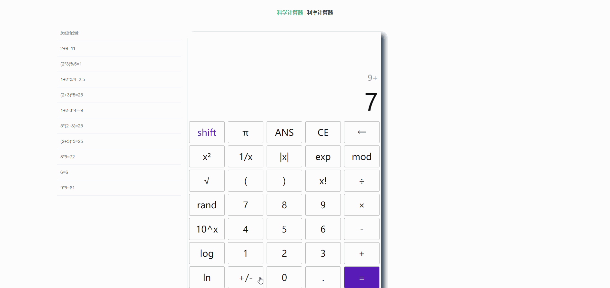
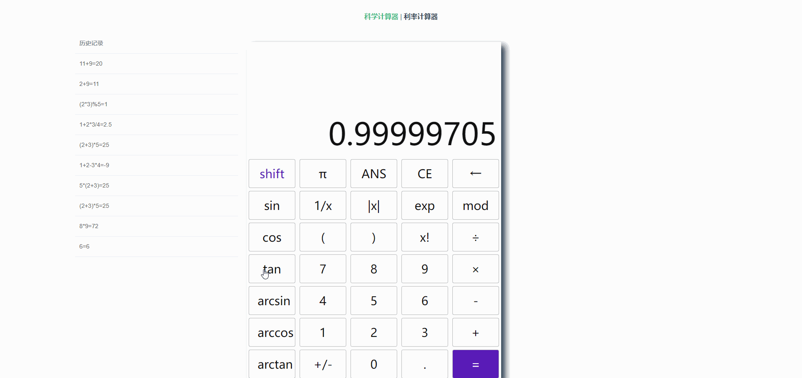
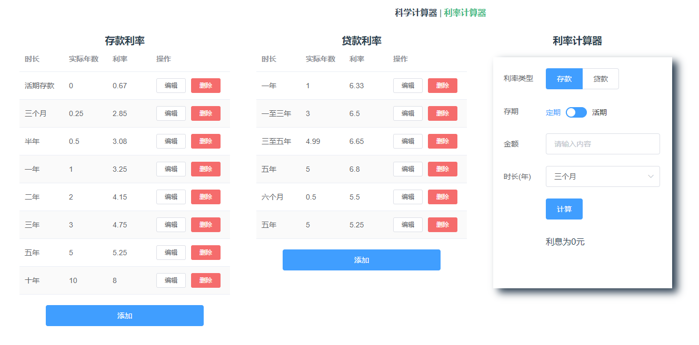
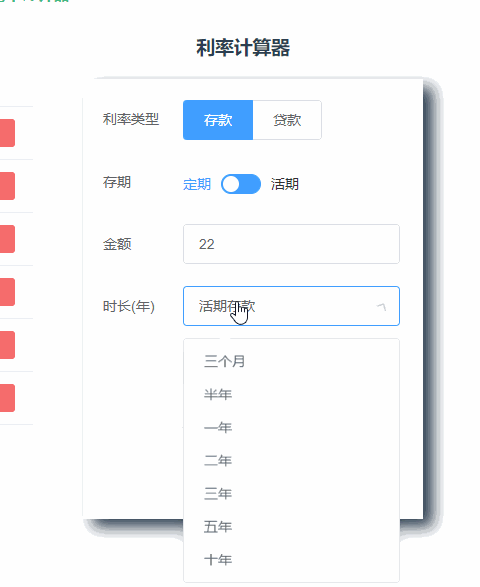
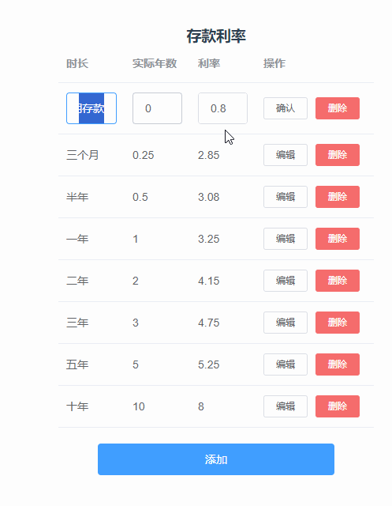
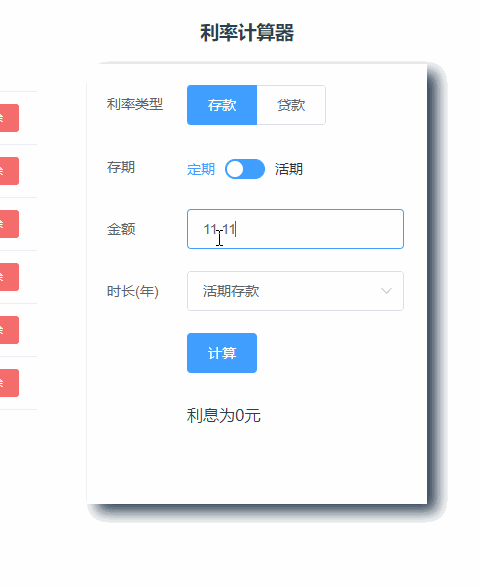
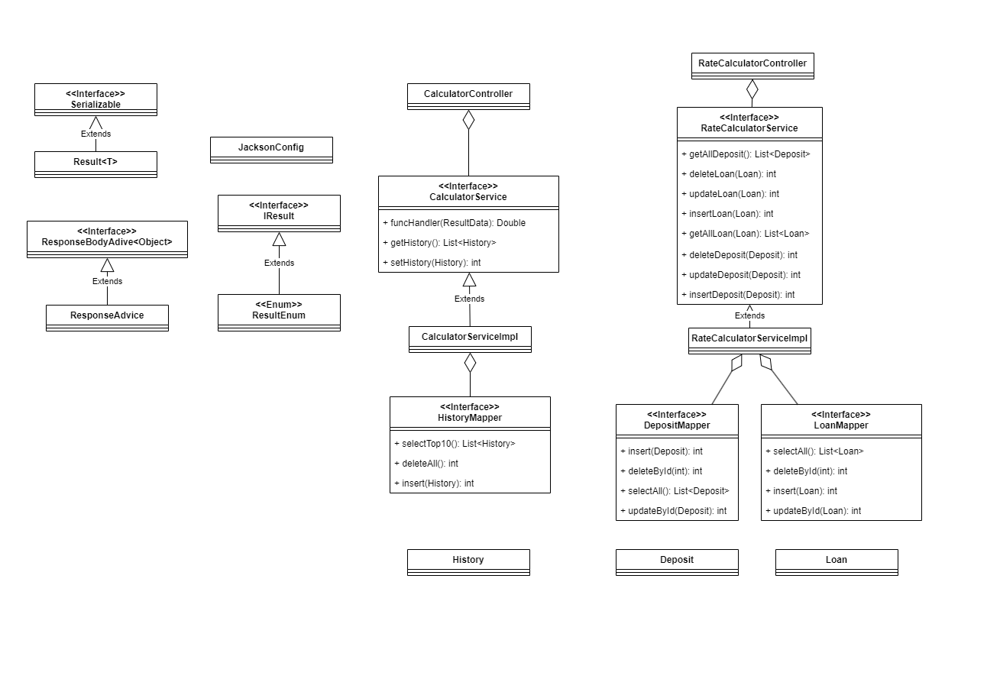

# 软件工程第二次作业——基于vue+Springboot的前后端交互计算器

学号：102101526 	姓名：易华章

[toc]

## 作业基本信息

| 这个作业属于哪个课程 | [2301-计算机学院-软件工程](https://bbs.csdn.net/forums/ssynkqtd-05) |
| :------------------- | :----------------------------------------------------------- |
| 这个作业要求在哪里   | [第二次作业--前后端交互计算器](https://bbs.csdn.net/topics/617377308) |
| 这个作业的目标       | 实现更完善的计算器功能，使用任意可视化技术实现一个前后端分离的计算器 |
| 其他参考文献         | [vue帮助文档](https://v2.cn.vuejs.org/)、[springboot帮助文档](https://docs.spring.io/spring-boot/docs/current/reference/html/index.html) |


## Github项目地址

[102101526_calculator_frontend](https://github.com/yihzh-cfdg/102101526_calculator_frontend)

[102101526_calculator_backend](https://github.com/yihzh-cfdg/102101526_calculator_backend)


## PSP表格

| PSP                                     | Personal Software Process Stages        | 预估耗时（分钟） | 实际耗时（分钟） |
| :-------------------------------------- | :-------------------------------------- | :--------------- | :--------------- |
| **Planning**                            | **计划**                                | **30**           | **30**           |
| • Estimate                              | • 估计这个任务需要多少时间              | 30               | 30               |
| **Development**                         | **开发**                                | **3260**         | **3650**         |
| • Analysis                              | • 需求分析 (包括学习新技术）            | 1500             | 1800~            |
| • Design Spec                           | • 生成设计文档                          | 30               | 30               |
| • Design Review                         | • 设计复审                              | 10               | 10               |
| • Coding Standard                       | • 代码规范 (为目前的开发制定合适的规范) | 10               | 10               |
| • Design                                | • 具体设计                              | 120              | 180              |
| • Coding                                | • 具体编码                              | 1440             | 1500             |
| • Code Review                           | • 代码复审                              | 120              | 60               |
| • Test                                  | • 测试（自我测试，修改代码，提交修改）  | 30               | 60               |
| **Reporting**                           | **报告**                                | **30**           | **60**           |
| • Test Repor                            | • 测试报告                              | 10               | 10               |
| • Size Measurement                      | • 计算工作量                            | 10               | 10               |
| • Postmortem & Process Improvement Plan | • 事后总结, 并提出过程改进计划          | 10               | 40               |
|                                         | **合计**                                | **3320**         | **3740**         |


## 成品展示

### 基础计算器功能

- **功能1：加减乘除、取余、括号运算**

实现了基本的加减乘除、括号匹配。


- **功能2：清零回退**


- **功能3：错误提示**

遇到错误时会锁定所有按钮（除了CE），并且在结果栏显示错误提示。



- **功能4：读取历史记录**

按下“ANS”，从上一次计算记录中取结果。


- **附加功能1：科学计算器**

实现了一些基本的函数



- **附加功能2：页面原型设计**


- 其他附加功能

​	上次Python计算器里面有的附加功能，这次我也在网页端实现了，有很多小细节的功能：

- [x] 算出结果之后再按等号可以循环做最后一次运算
- [x] 算出结果之后立马可以进行下一次运算，不用按CE
- [x] 已有符号的表达式可以随意更换符号
- [x] 分成两栏，上栏显示当前的表达式，下栏显示实时的运算结果
- [x] 在碰到`5*=`这种输入的时候会变成`5*5=`，避免了错误
- [x] 自动匹配括号
- [x] 应用函数时只对下栏的运算结果生效，间接维护了运算符号顺序
- [x] 拥有像电子计算器的`shift`键，可以在布局中切换不同函数
- [x] 错误处理和异常情况处理
- [x] 历史记录功能

顺便把上次项目没做的历史记录和括号匹配也给补全了。

- **项目部署**

前端通过Nginx部署在81端口，后端部署在服务器后台。

[102101526-calculator-frontend](http://47.110.148.166:81/#/calculator)


### 利率计算器功能



- **功能1：计算存款、贷款利息**

选择定期存款时时长是选择框，选择活期存款可以自由输入时长。



- **扩展功能：前端修改存贷款利息**

实现了基础的增删改查：



- **扩展功能：输入验证（有点基础，但是好像也能算扩展）**

在两个input上加了原生的onkeyup函数，通过正则表达式限制输入，金额只能输入最多带六位小数的数字，时长只能输入最多带两位小数的数字。




## 设计实现过程

​	这次看到要设计一个前后端分离的计算器，第一时间想到的就是去学大名鼎鼎的spring+vue，但是没想到前置知识这么多，还好ddl延长了一周，不然连javaweb都学不完。好在学会之后，感觉非常简便非常好用。代码风格参考了阿里的Java开发手册。

### 项目设计

这个项目被我分为6个部分：

1. 分析题目，列出学习要求，在本次作业中是ssm和vue
2. 学习相关技术
3. 分析需求，包括需要的接口、支持的功能、需要的数据库表等
4. 在原型设计软件中设计软件原型
5. 实现程序代码+debug
6. 写blog

实际上做起来还是非常赶（肝），前面偷懒，这几天爆肝把代码写完了。

这次毕竟是学了框架的，画了张MVC的类图：



​	前端通过axios联系后端，后端中的Controller负责收发调度，Service负责具体的业务逻辑实现，Mapper负责数据库的数据访问。

### 代码实现

#### 前端

使用Vue+ElementUI进行前端开发，用Axios和后端通信。

**科学计算器**

```html
<template>
  <div>
    <el-container>
      <el-aside width="10%"></el-aside>
      <el-aside width="20%">
        <el-table :data="tableData" style="width: 100%">
          <el-table-column prop="exps" label="历史记录"></el-table-column>
        </el-table>
      </el-aside>
      <el-main width="800px">
        <div class="back" style="box-shadow: 10px 8px 15px">
          <div class="side-text">
            <p class="side-exp">{{ old_exp }}</p>
          </div>
          <div class="main-text">
            <template v-if="true">
              <p class="main-exp">{{ currentVal }}</p>
            </template>
            <template v-else>
              <p class="main-exp">0</p>
            </template>
          </div>
          <div>
            <el-row class="keys">
              <el-button :disabled="isDisabled" class="shift" @click="onShiftClick">
                shift
              </el-button>
              <el-button :disabled="isDisabled" id="pi" class="func" @click="clickHandler($event)">
                π
              </el-button>
              <el-button :disabled="isDisabled" class="func" @click="getAns">ANS</el-button>
              <el-button id="ce" class="func" @click="clickHandler($event)">CE</el-button>
              <el-button :disabled="isDisabled" id="del" class="func" @click="clickHandler($event)">
                ←
              </el-button>
            </el-row>
            ...(下面都是一样的按钮)
          </div>
        </div>
      </el-main>
    </el-container>
  </div>
</template>
```

用了特别多elementui的组件，写的特别丑。用key、func、num等类来调整样式。

**利率计算器**

用了el-container布局，其实就是表格+表格+表单。

```html
<el-container>
    <el-aside width="400px" style="margin-left: 160px">
     <el-table :data="tableData1" stripe>
         ...
     </el-table>
    </el-aside>
    <el-aside width="400px" style="margin-left: 50px">
     <el-table :data="tableData2" stripe>
         ...
     </el-table>
    </el-aside>
    <el-aside style="width: 420px; height: 600px">
      <el-form>
         ...
      </el-form>
    </el-aside>
  </el-container>
</template>
```


#### 后端

##### 科学计算器

这次计算器还是做的挺不错：

- 功能齐全
- 看起来像计算器
- 还原原型设计

​	但是有个问题就是前后端分的不是很离，一开始我认为前后端分离是前端只负责页面展示，把所有请求都发到后端，让后端计算，但是这一次由于时间匆忙，没时间从头在Java里面造eval()的轮子，只好使用js自带的eval()了。所以我这是前端前台渲染+后台计算+后端处理数据，也算是前后端分离了，刚开始还觉得怪不好意思的，后面问了老师+看大伙好像都是这样做的。

使用SpringBoot框架开发，数据访问用了MyBatis。主要学了下面向注解开发，把所有的精力都放到业务逻辑实现，写的特别爽。

定义了一些类：

- xxxBean，实体类
- xxxMapper：接口，利用注解定义方法，自动装填成bean
- xxxService：接口，用于定义各种服务，这次作业里面有`CalculatorService`和`RateCalculatorService`
- xxxServiceImpl：对应接口的实现类
- xxxController：控制器类，定义暴露给前端的接口，并收发请求，调用Service执行业务。

后端主要负责历史记录管理：

**CalculatorController**

```java
@RestController
@CrossOrigin
@RequestMapping("/api/cal")
public class CalculatorController {
    @Autowired
    CalculatorService calculatorService;

    @Deprecated
    @PostMapping("/getResult")
    public Double funcHandler(@RequestBody ResultData data){
        return calculatorService.funcHandler(data);
    }

    @PostMapping("/setHistory")
    public Result<String> setHistory(@RequestBody History history){
        int res = calculatorService.setHistory(history);
        return Result.success("Success Insert " + res);
    }
    @ResponseBody
    @GetMapping("/getHistory")
    public List<History> sendHistory(){
        return calculatorService.getHistory();
    }
}

```

定义了/api/cal/接口，让前端通过ajax请求访问。

**CalculatorServiceImpl**、

```java
@Service("calculatorService")
public class CalculatorServiceImpl implements CalculatorService {
    @Autowired
    private HistoryMapper historyMapper;

    @Deprecated
    @Override
    public Double funcHandler(ResultData resultData) {...}

    @Override
    public List<History> getHistory() {
        return historyMapper.selectTop10();
    }

    @Override
    public int setHistory(History history) {
        return historyMapper.insert(history);
    }
}
```

实现业务逻辑，本来还想在后端完成函数计算的，由于时间不够作罢，留下了funcHandler这个类，标成弃用，希望以后有机会再完善。。

**HistoryMapper**

```java
@Mapper
public interface HistoryMapper{
    @Select("SELECT * FROM history ORDER BY hno DESC LIMIT 10;\n")
    List<History> selectTop10();

    @Delete("delete from history")
    int deleteAll();

    @Insert("insert into history values(null, #{exps}) ")
    int insert(History history);
}

```

实现数据访问操作。

##### 利率计算器

```java
@RestController
@CrossOrigin
@RequestMapping("/api/rate")
public class RateCalculatorController {
    @Autowired
    RateCalculatorService rateCalculatorService;
    @ResponseBody
    @GetMapping("/getDeposit")
    public List<Deposit> sendAllDeposit()
    {
        List<Deposit> a = rateCalculatorService.getAllDeposit();
       return a;
    }
    @ResponseBody
    @GetMapping("/getLoan")
    public List<Loan> sendAllLoan()
    {
        return rateCalculatorService.getAllLoan();
    }
    @PostMapping("/updateLoan")
    public Result<String> setLoan(@RequestBody Loan loan)
    {
        int res = rateCalculatorService.updateLoan(loan);
        return Result.success("Success set "+ res);
    }
    @PostMapping("/updateDeposit")
    public Result<String> setDeposit(@RequestBody Deposit deposit)
    {
        int res = rateCalculatorService.updateDeposit(deposit);
        return Result.success("Success set "+ res);
    }
    @PostMapping("/delLoan")
    public Result<String> delLoan(@RequestBody Loan loan)
    {
        int res = rateCalculatorService.deleteLoan(loan);
        return Result.success("Success del "+ res);
    }
    @PostMapping("/delDeposit")
    public Result<String> delDeposit(@RequestBody Deposit deposit)
    {
        int res = rateCalculatorService.deleteDeposit(deposit);
        return Result.success("Success del "+ res);
    }
    @ResponseBody
    @PostMapping("/insertDeposit")
    public Result<String> insertDeposit(@RequestBody Deposit deposit)
    {
        int res = rateCalculatorService.insertDeposit(deposit);
        return Result.success("Success insert "+ res);
    }
    @ResponseBody
    @PostMapping("/insertLoan")
    public Result<String> insertDeposit(@RequestBody Loan loan)
    {
        int res = rateCalculatorService.insertLoan(loan);
        return Result.success("Success insert "+ res);
    }
}

```

同样也是CURD，不再赘述。

##### Controller层处理

**统一返回结构**

定义返回的数据格式

```java
public interface IResult {
    Integer getCode();

    String getMessage();
}
```

定义枚举

```java
@Getter
public enum ResultEnum implements IResult {

    SUCCESS(2001, "接口调用成功"),
    VALIDATE_FAILED(2002, "参数校验失败"),
    COMMON_FAILED(2003, "接口调用失败"),
    FORBIDDEN(2004, "没有权限访问资源");

    private Integer code;
    private String message;

    ResultEnum(Integer code, String message) {
        this.code = code;
        this.message = message;
    }
}
```

定义Result类

```java
@Data
@NoArgsConstructor
@AllArgsConstructor
public class Result<T> implements Serializable {
    private Integer code;
    private String message;
    private T data;
    public static <T> Result<T> success(T data) {
        return new Result<>(ResultEnum.SUCCESS.getCode(), ResultEnum.SUCCESS.getMessage(), data);
    }
    public static <T> Result<T> success(String message, T data) {
        return new Result<>(ResultEnum.SUCCESS.getCode(), message, data);
    }
    public static Result<?> failed() {
        return new Result<>(ResultEnum.COMMON_FAILED.getCode(), ResultEnum.COMMON_FAILED.getMessage(), null);
    }
    public static Result<?> failed(String message) {
        return new Result<>(ResultEnum.COMMON_FAILED.getCode(), message, null);
    }
    public static Result<?> failed(IResult errorResult) {
        return new Result<>(errorResult.getCode(), errorResult.getMessage(), null);
    }
    public static <T> Result<T> instance(Integer code, String message, T data) {
        Result<T> result = new Result<>();
        result.setCode(code);
        result.setMessage(message);
        result.setData(data);
        return result;
    }
}
```

这样一来，后端返回的就是统一封装好的`Result`，方便前端知道这个接口的调用是否成功。


## 心路历程和收获
