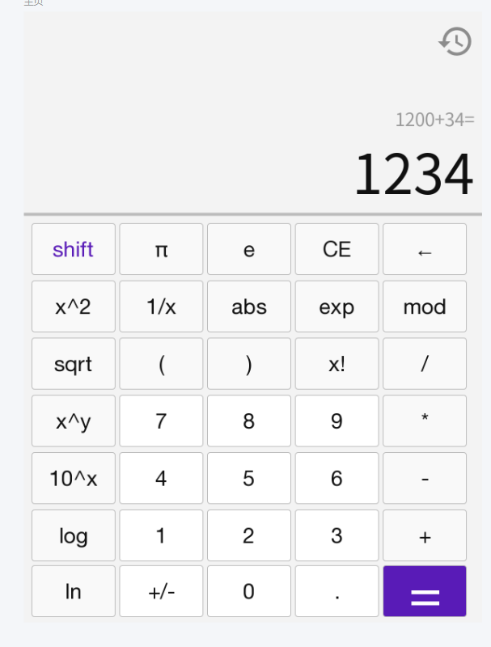
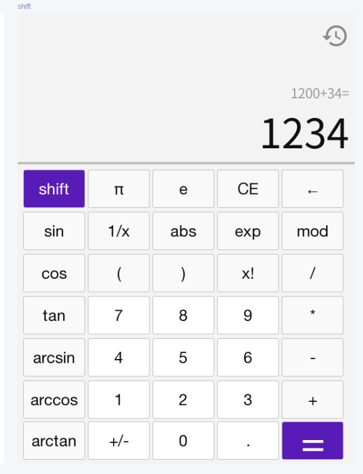

# 软件工程第二次作业——基于vue+Springboot的前后端交互计算器

学号：102101526 	姓名：易华章

[toc]

## 作业基本信息

| 这个作业属于哪个课程 | [2301-计算机学院-软件工程](https://bbs.csdn.net/forums/ssynkqtd-05) |
| :------------------- | :----------------------------------------------------------- |
| 这个作业要求在哪里   | [第二次作业--前后端交互计算器](https://bbs.csdn.net/topics/617377308) |
| 这个作业的目标       | 实现更完善的计算器功能，使用任意可视化技术实现一个前后端分离的计算器 |
| 其他参考文献         | [vue帮助文档](https://v2.cn.vuejs.org/)、[springboot帮助文档](https://docs.spring.io/spring-boot/docs/current/reference/html/index.html) |

## Github项目地址

[102101526_calculator_frontend](https://github.com/yihzh-cfdg/102101526_calculator_frontend)

[102101526_calculator_backend](https://github.com/yihzh-cfdg/102101526_calculator_backend)

## PSP表格

| PSP                                     | Personal Software Process Stages        | 预估耗时（分钟） | 实际耗时（分钟） |
| :-------------------------------------- | :-------------------------------------- | :--------------- | :--------------- |
| **Planning**                            | **计划**                                | **30**           | **30**           |
| • Estimate                              | • 估计这个任务需要多少时间              | 30               | 30               |
| **Development**                         | **开发**                                | **3260**         | **3650**         |
| • Analysis                              | • 需求分析 (包括学习新技术）            | 1500             | 1800~            |
| • Design Spec                           | • 生成设计文档                          | 30               | 30               |
| • Design Review                         | • 设计复审                              | 10               | 10               |
| • Coding Standard                       | • 代码规范 (为目前的开发制定合适的规范) | 10               | 10               |
| • Design                                | • 具体设计                              | 120              | 180              |
| • Coding                                | • 具体编码                              | 1440             | 1500             |
| • Code Review                           | • 代码复审                              | 120              | 60               |
| • Test                                  | • 测试（自我测试，修改代码，提交修改）  | 30               | 60               |
| **Reporting**                           | **报告**                                | **30**           | **60**           |
| • Test Repor                            | • 测试报告                              | 10               | 10               |
| • Size Measurement                      | • 计算工作量                            | 10               | 10               |
| • Postmortem & Process Improvement Plan | • 事后总结, 并提出过程改进计划          | 10               | 40               |
|                                         | **合计**                                | **3320**         | **3740**         |

## 成品展示

### 基础计算器功能

- **功能1：加减乘除、取余、括号运算**

- **功能2：清零回退**

- **功能3：错误提示**

- **功能4：读取历史记录**

- **附加功能1：科学计算器**

- **附加功能2：页面原型设计**

- 其他附加功能

- **项目部署**

### 利率计算器功能

- **功能1：计算存款、贷款利息**

- **扩展功能：前端修改存贷款利息**

实现了增删改查

- **扩展功能：输入验证**

## 设计实现过程

## 代码说明

## 心路历程和收获
